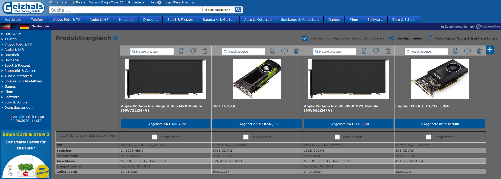

<h2 align="center">Your eyes will&nbsp;:heart:&nbsp;you.</h2>

## Preview

## Installation

Install [Stylus](https://add0n.com/stylus.html) for either [Firefox](https://addons.mozilla.org/en-US/firefox/addon/styl-us/), [Chrome](https://chrome.google.com/webstore/detail/stylus/clngdbkpkpeebahjckkjfobafhncgmne) or [Opera](https://addons.opera.com/en-gb/extensions/details/stylus/) or [Cascadea for Safari](https://cascadea.app/) and then install using one of these methods:

📦 [Install the usercss](https://raw.github.com/kantmn/CSS-Darkmode-Stylus-Stylish-for-Geizhals.-/blob/master/css.style.darkmode.geizhals.user.css) which supports automatic updates and customization. 
📦 [Install manually from GitHub](https://raw.github.com/kantmn/CSS-Darkmode-Stylus-Stylish-for-Geizhals.-/blob/master/css.style.darkmode.geizhals.css) with no customization, but useful for development. The style is in Mozilla format. 
